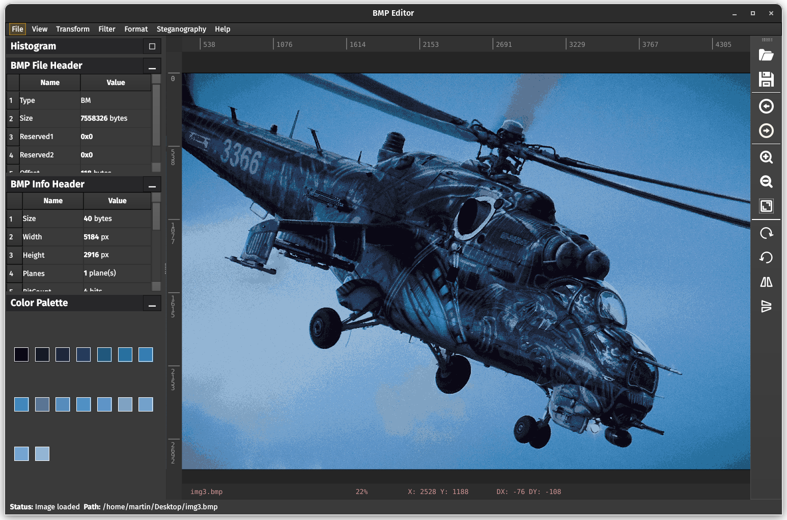

<div align="center">
  
  <h1>BMP Editor</h1>
  <div>
    
    
    
    
  </div>
  <i>A simple BMP image viewer, converter and editor</i>
</div>

## ℹ️ About

The BMP Editor tool for editing BMP images, offering a base range of features to enhance and manipulate images with ease. This application was developed as a student project and primarily focuses on implementing of own solution for working with BMP images.


## 🛠️ How to build (Linux / MacOS) ?
```
cd BMPEditor
mkdir build
cd build
cmake -S ..
make
```

## 🎨 Features

1. __Open/Save BMP Image:__ Easily open and save BMP images in various color depths (1b, 4b, 8b, or 24b per pixel).

1. __View BMP Image:__ View your BMP image in the central workspace, providing a clear and detailed representation.

1. __Custom Code for BMP Image:__ Implement custom code to manipulate BMP images according to your specific requirements.

1. __Raw Data Display:__ Gain insight into the BMP file header and BMP info header with raw data display features.

1. __Color Palette:__ For images with color depths of 1b, 4b, and 8b, view and manipulate the color palette as needed.

1. __RGB Histogram:__ Compute and display the RGB histogram for a comprehensive understanding of color distribution.

1. __Image Transforms:__ Rotate and flip images easily to achieve the desired orientation.

1. __Filters:__ Apply various filters such as sepia, invert color, grayscale, brightness, contrast, and color balance to enhance your images. Filters can adapt to images using color palettes.

1. __Kernel Transformation:__ Utilize custom kernels for transformations like blur, edge detection, and emboss.

1. __Steganography:__ Encrypt and decrypt messages within images using CRC32 for secure communication.

1. __Image Format Conversion:__ Convert images to BMP format with different color depths (1b, 4b, 8b, or 24b) as needed.

1. __History Tracking:__ Keep track of transformation and filter operations with undo and redo functionalities.

1. __Import Any Image:__ Import images of any type and convert them into BMP format (24b) for seamless integration with your editing workflow.

## 🖥️ Application UI

The BMP Editor's intuitive interface is divided into three sections. On the left, an informative panel displays details about the loaded image. The central workspace showcases the currently edited image, while the toolbar on the right provides quick access to essential tools such as opening and saving images, undoing and redoing actions, and various transformations


__Pixel Grid:__ The pixel grid is automatically displayed in workspace when the pixels are already large enough. It is used for easier visual separation of individual pixels.


## 🌈 Filters

Example showcasing various image filters applied simultaneously in the BMP Editor, including color balance, color inversion, and blur.


Example demonstrating the application of the edge detection filter in the BMP Editor, highlighting edges and contours in the image.


## 🔄 Color Conversion with Median Cut Algorithm Quantization

This image illustrates the capability of the BMP Editor to convert images into different formats with varying bit depths. Utilizing the Median Cut algorithm for color quantization, the editor automatically generates a color palette to ensure optimal color representation. Witness seamless conversion with reduced color depth while maintaining visual integrity, allowing for efficient storage and transmission of images.



# 👩‍💻 Author

[](https://github.com/0xMartin)
